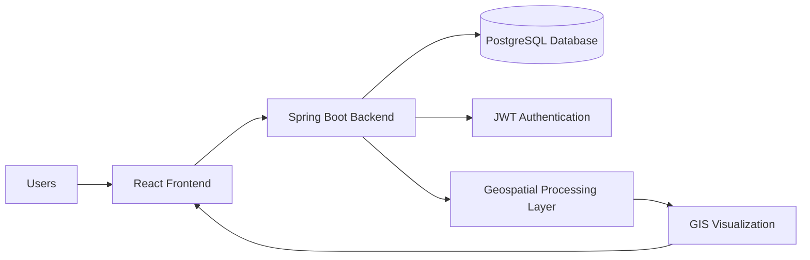
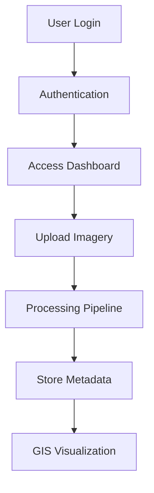
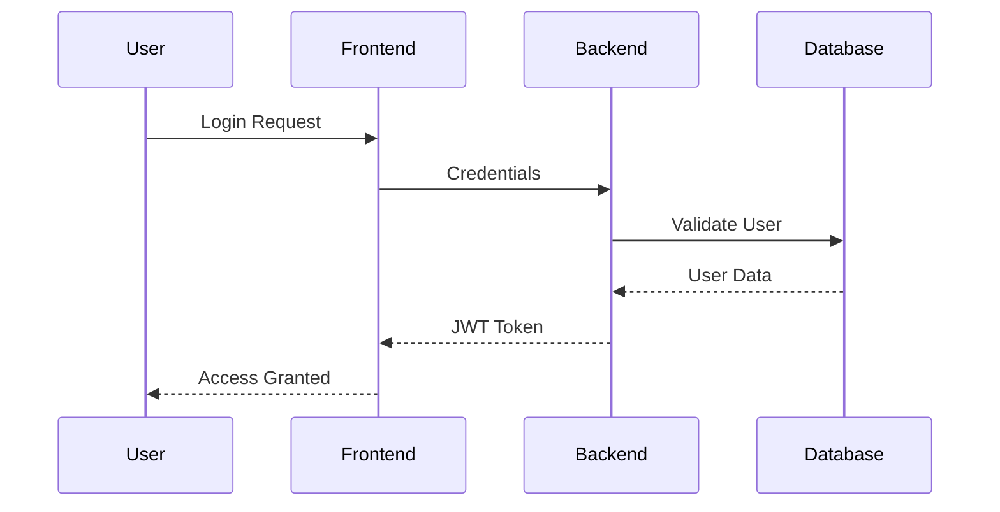

# 🚀 GeoVision

> AI-Powered Geospatial Intelligence Platform for Land Monitoring, Satellite Imagery Analysis, and GIS Visualization.


---

## 📖 Overview

GeoVision is an AI-powered geospatial intelligence platform that enables organizations to securely manage, process, and visualize satellite imagery through an interactive GIS dashboard.

The platform bridges the gap between raw geospatial data and actionable insights by combining secure authentication, modern web technologies, geospatial workflows, and scalable backend architecture.

GeoVision is designed to support future land intelligence applications such as:

- Land parcel monitoring
- Ownership mapping
- Land-use classification
- Satellite imagery enhancement
- GIS-based decision support systems
- Government and municipal land management

---

# 🎯 Problem Statement

Land administration and monitoring workflows often rely on fragmented systems for satellite imagery processing, GIS visualization, and data management.

Organizations face challenges such as:

- Scattered geospatial data sources
- Lack of centralized visualization
- Manual image processing workflows
- Limited accessibility for non-technical users
- Difficulty integrating GIS and business applications

GeoVision addresses these challenges by providing a centralized platform where users can securely access, upload, process, and visualize geospatial information through a modern web interface.

---

# ✨ Key Features

## 🔐 Authentication & Security

- User Registration
- Secure Login
- JWT Authentication
- Role-Based Authorization
- Protected API Endpoints
- Spring Security Integration

---

## 🛰️ Geospatial Data Management

- Satellite Imagery Upload
- Geospatial Data Storage
- Metadata Management
- Imagery Processing Foundation
- Future-Ready AI Processing Pipeline

---

## 🗺️ GIS Visualization

- Interactive GIS Dashboard
- Leaflet-Based Mapping
- Dynamic Layer Rendering
- Geospatial Data Exploration
- Map-Based Visualization

---

## 📊 Dashboard

- Centralized User Dashboard
- Secure Resource Access
- Workflow Management
- Scalable Architecture

---

# 🏗️ System Architecture



---

# 🔄 Application Workflow



---

# 🔐 Authentication Flow



---

# 🛠️ Technology Stack

## Frontend

- React
- TypeScript
- Vite
- Axios
- React Router
- Leaflet

---

## Backend

- Java 21
- Spring Boot
- Spring Security
- Spring Data JPA
- Hibernate
- Maven

---

## Database

- PostgreSQL

---

## Security

- JWT Authentication
- Role-Based Access Control (RBAC)

---

## GIS & Mapping

- Leaflet
- Geospatial Visualization
- Satellite Imagery Workflows

---

## DevOps & Tools

- Git
- GitHub
- Docker (Optional)
- Postman

---

# 📂 Project Structure

```text
GeoVision
│
├── backend
│   ├── controller
│   ├── service
│   ├── repository
│   ├── entity
│   ├── dto
│   ├── config
│   ├── security
│   └── exception
│
├── frontend
│   ├── pages
│   ├── components
│   ├── services
│   ├── hooks
│   ├── routes
│   ├── assets
│   └── utils
│
└── database
```

---

# 🔐 Authentication & Authorization

GeoVision uses JWT (JSON Web Token) authentication to secure API communication.

### Authentication Process

1. User submits login credentials.
2. Backend validates user details.
3. JWT token is generated.
4. Token is returned to the frontend.
5. Frontend stores the token securely.
6. Every protected request includes the token.
7. Backend validates token before processing requests.

---

### Authorization

Role-based authorization ensures users only access resources permitted for their role.

Supported roles may include:

- Administrator
- Surveyor
- Officer
- General User

---

# 🌐 API Overview

## Authentication APIs

```http
POST /api/auth/register
POST /api/auth/login
```

---

## User APIs

```http
GET /api/users
GET /api/users/{id}
```

---

## Imagery APIs

```http
POST /api/imagery/upload
GET /api/imagery
GET /api/imagery/{id}
```

---

# 🗄️ Database Design

## User Entity

```text
id
name
email
password
role
createdAt
updatedAt
```

---

## Imagery Entity

```text
id
fileName
fileType
status
uploadedBy
createdAt
updatedAt
```

---

### Relationship

```text
User
 │
 └── Uploads
          │
          └── Imagery
```

---

# 🎨 Frontend Architecture

The frontend follows a component-based architecture for scalability and maintainability.

### Pages

```text
Login
Register
Dashboard
GIS Dashboard
```

---

### Components

```text
Navbar
Sidebar
Upload Module
Map Components
Authentication Components
```

---

### Responsibilities

- Authentication
- Routing
- API Communication
- Dashboard Rendering
- GIS Visualization

---

# ⚙️ Backend Architecture

The backend follows a layered architecture pattern.

```text
Controller
     ↓
Service
     ↓
Repository
     ↓
Database
```

---

### Controller Layer

Handles incoming HTTP requests.

### Service Layer

Contains business logic.

### Repository Layer

Handles database operations.

### Security Layer

Manages JWT authentication and authorization.

---

# 🛰️ Geospatial Workflow

```text
User Uploads Imagery
          ↓
File Validation
          ↓
Metadata Extraction
          ↓
Storage
          ↓
Processing Pipeline
          ↓
GIS Visualization
```

---

# 🔒 Security Features

GeoVision implements enterprise-grade security practices.

### Features

- JWT Authentication
- Password Encryption
- Protected Routes
- Role-Based Authorization
- Secure API Access
- Spring Security Integration

---

# 🚀 Getting Started

## Prerequisites

Install the following:

- Java 21+
- Node.js 20+
- PostgreSQL 16+
- Maven
- Git

---

# ⚙️ Backend Setup

Clone repository:

```bash
git clone https://github.com/your-username/geovision.git
```

Navigate to backend:

```bash
cd backend
```

Build project:

```bash
mvn clean install
```

Run application:

```bash
mvn spring-boot:run
```

Backend runs at:

```text
http://localhost:8080
```

---

# 🎨 Frontend Setup

Navigate to frontend:

```bash
cd frontend
```

Install dependencies:

```bash
npm install
```

Start development server:

```bash
npm run dev
```

Frontend runs at:

```text
http://localhost:5173
```

---

# 🗄️ Database Setup

Create PostgreSQL database:

```sql
CREATE DATABASE geovision;
```

Configure database credentials inside:

```properties
application.properties
```

```properties
spring.datasource.url=jdbc:postgresql://localhost:5432/geovision
spring.datasource.username=postgres
spring.datasource.password=your_password
```

---

# 📸 Screenshots

## 🔑 Login Page

> Add screenshot here

```text
docs/screenshots/login.png
```

---

## 📊 Dashboard

> Add screenshot here

```text
docs/screenshots/dashboard.png
```

---

## 🗺️ GIS Dashboard

> Add screenshot here

```text
docs/screenshots/gis-dashboard.png
```

---

# 🛣️ Future Roadmap

### Phase 1

- Enhanced Imagery Upload Pipeline
- Geospatial Metadata Extraction

### Phase 2

- GeoTIFF & JP2 Processing
- Real-Time Processing Status

### Phase 3

- AI-Based Image Enhancement
- Super Resolution Workflows

### Phase 4

- Parcel Boundary Detection
- Ownership Mapping
- Land Use Classification

### Phase 5

- PostGIS Integration
- Spatial Search & Analytics

### Phase 6

- Cloud-Native Deployment
- Large Scale Geospatial Processing

---

# 🤝 Contributing

Contributions are welcome.

### Steps

1. Fork the repository
2. Create a feature branch

```bash
git checkout -b feature/new-feature
```

3. Commit changes

```bash
git commit -m "Add new feature"
```

4. Push branch

```bash
git push origin feature/new-feature
```

5. Open a Pull Request

---

# 📜 License

This project is licensed under the MIT License.

---

# 👨‍💻 Team

Built with passion for geospatial innovation, modern software engineering, and Smart India Hackathon.

### GeoVision

**Transforming Satellite Data into Actionable Intelligence. 🌍**
